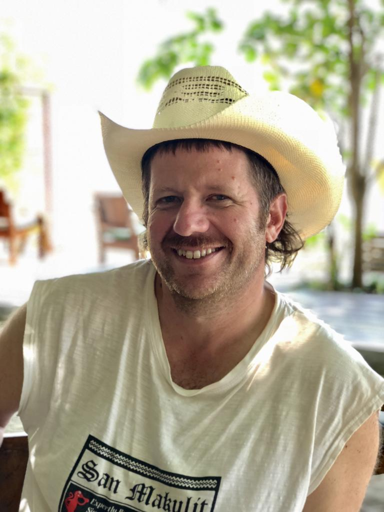

# About the Author {-}

[{ width=50% }](https://www.micahwoods.com/)
 

Micah Woods, Ph.D., is the founder and chief scientist of the [Asian Turfgrass Center](https://www.asianturfgrass.com/). Since graduating from Oregon State University in 1998, Micah has been traveling extensively, collecting data, and advising turfgrass managers across Asia, Australia, North America, and Europe. From 2001 to 2005, he was in New York to study with Frank Rossi at Cornell University. The broad scope of his research on grasses around the world led to his collaboration with scientists from PACE Turf to create the MLSN guidelines which are applicable to turf in all climate zones, or as he says, "any grass, anywhere." You can read more about Micah’s unique take on tending turfgrass in his book, [A Short Grammar of Greenkeeping](https://leanpub.com/short_grammar_of_greenkeeping), as well as on his website, <www.asianturfgrass.com>.   
