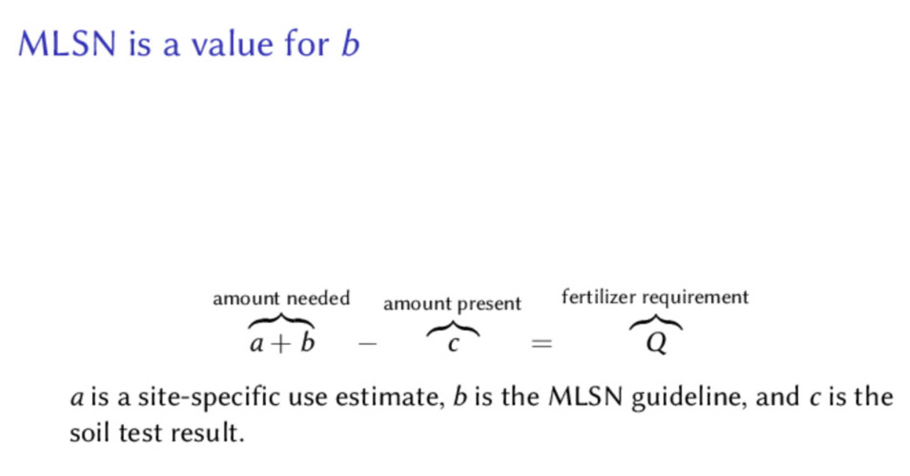

# A refresher

## Using MLSN in a tropical climate

In Brad Revill's [detailed blog posts](https://brtagronomy.com/goingagainstthegrain/category/MLSN) about his experiences using MLSN, he wrote "it has been around 8 months since we started following the MLSN guidelines and we have been very happy with the results, not just from a turf performance point of view but from the financial side as well!" There are lots of details about what he's been doing to apply the guidelines in a tropical climate, and a 69% savings in fertilizer cost.

## Soil test extraction methods

Many people ask about using the MLSN guidelines when the soil test was done with an extractant other than Mehlich 3. For the cations K, Ca, and Mg, the common extractant to use instead of Mehlich 3 is a solution of ammonium acetate (AA). This is sometimes written as 1 *N* NH~4~OAc, for "one normal ammonium acetate," and that means there is one mole of ammonium per liter of solution. Let's say you have ammonium acetate soil test data and you want to use the MLSN approach to soil test interpretation. What you can do is adjust the MLSN guidelines to their estimated values in an ammonium acetate extraction. Mehlich 3 extracts more of those elements than does AA. Adolf Mehlich found 6 to 8% more K and Mg extracted by Mehlich 3 than by AA; Quirine Ketterings at Cornell did a comparison for soils in New York and using her lab's conversion equations the ammonium acetate equivalent of the MLSN guidelines would be 31 ppm for K, 41 ppm for Mg, and 248 ppm for Ca. For P, one can look at the 2012 version of the MLSN guidelines, which had a Bray-2 minimum of 25 ppm and an Olsen minimum of 6 ppm. But rather than make all the conversions, which introduce some unknown amounts of error, I'd recommend eventually doing soil tests with a Mehlich 3 extraction if you are going to use the current version of MLSN. It's easier that way, with less chance of error.

## An MLSN refresher

Grass is growing in soil. That soil has a certain amount of nutrients in it. We determine that quantity of nutrients by doing a soil nutrient analysis (a soil test). The amount of nutrients in the soil will change tomorrow, and the next day, and into the future, based on how much we apply as fertilizer, and based on how much the grass uses. But we can use this number. I'm going to call this soil number *c*. That's the quantity of a nutrient measured by the soil test.

On its own, that soil test number isn't useful for anything. I need to compare it to something. How about comparing the amount of a nutrient in the soil to the amount of a nutrient the grass will use? Now I am introducing a time component, because the grass use during 1 month of dormancy is different than the amount of grass use during 1 month of active growth. And the amount of use for 1 day is different than the amount of nutrient use in 1 year. The use is different in different locations and the use is different for different grasses. Use of the MLSN guidelines *explicitly accounts for* the expected use of nutrients at any location. Let's call the expected use by the grass *a*. 

Now we have two quantities. We have *a*, which is the amount the grass will use. And we have *c*, which is the amount in the soil. It would seem that this is enough information to determine a fertilizer requirement. We could say if *a* is more than *c*, then we definitely need to add the difference, because otherwise the grass will use more than the soil has. And we could say that if *a* is smaller than *c*, we don't need to add that element, because the amount the grass will use is less than the amount in the soil. And that is sort of how it works, but the MLSN guideline adds a buffer of extra nutrients that the grass will never touch.

The MLSN guidelines are added to the amount the grass will use. We can call the MLSN guideline amount *b*. The amount *b* is a quantity of nutrients that we always want to remain in the soil, untouched by the grass. So we take *a*, the amount the grass will use, and add to it *b*, the amount we want to keep as a reserve in the soil. We then compare *a* + *b* to *c*, and that difference becomes the fertilizer requirement. 

{ width=100% }

With this procedure, the site specific and grass specific and climate specific characteristics of each location are considered, and then an appropriate fertilizer recommendation is made. This fertilizer recommendation for each nutrient is based on how much the grass will use at each site, it accounts for keeping a reserve of nutrients in the soil (the MLSN guideline), and for how much of an element is actually in the soil at the time of sampling.

The MLSN guideline values are the only thing that stays the same. These represent a buffer amount of nutrients in the soil that we don't want the grass to use. Then the site specific values for estimated grass use of each element, and for the actual soil test at that site, make the MLSN approach suitable for just about every environment.

A few months ago I pulled out my old copy of Alister MacKenzie's *The Spirit of St. Andrews*. I turned to the Greenkeeping chapter, and I soon came across this quote: "It is of importance that greenkeepers realize that the fundamental principle of successful greenkeeping is the recognition of the fact that the finest golfing grasses flourish on poor soil and that more harm is done by over-, rather than underfertilizing." MLSN fits right in with this.

There are some calculations in the background to get the fertilizer recommendations, and these calculations, if I'd explain them in words, are saying "ok, for this site the soil contains a certain amount of nutrients, and the grass is going to be grown at the rate the greenkeeper specifies, and based on the grass species being grown, and this particular soil condition, then the maximum amount of each element the grass can use is this. If the soil already has that maximum amount, and also has the MLSN guideline amount in reserve -- that's what I'd call enough -- then there is no need to add that element as fertilizer. But if there isn't enough in the soil, then that element should be added as fertilizer."

MLSN is all about being site specific, letting the turfgrass manager be in control, and doing a calculation to find how much of each element the grass can possibly use at that site, while still keeping the MLSN amount untouched as a reserve in the soil. In this way, it is similar to the philosophy of MacKenzie. And it is quite different from the conventional guidelines set at "ideal" or "optimum" ranges in the soil. MLSN is about supplying what the grass can use. It isn't about growing a bumper crop of garden vegetables.

## MLSN and roots

The [#MLSN hashtag](https://twitter.com/search?q=%23MLSN&src=hashtag_click) on Twitter is a way to follow along with occasional photos or discussion of this approach. I saw a proliferation of root photos, from Sue Crawford, Eli Rahz, Jason Haines -- he didn't use the hashtag but I know he's using MLSN, and even Andrew McDaniel. Brad Revill wrote on his blog that "we have seen a steady increase in root depth." I think it's great that turfgrass managers are finding good roots when using MLSN. This is no surprise to me. You probably know that I try to discourage a focus on roots, and try to encourage a focus on playing surfaces. If one does that, and creates the right growing environment for roots, they just happen. Making sure the grass is supplied with enough nutrients, by using MLSN, is one part of creating the right growing environment. 

## Is anyone in my area using MLSN?

I'll sometimes receive an e-mail out of the blue from someone writing with a variation of this question, "Do you know anyone in my area using MLSN?"

Usually I don't have a good answer for that, because the world is a big place, and I get inquiries from all over. In fact, I've sometimes been a little curt with my reply to those inquires. I figure that if the logic and simplicity of MLSN doesn't make sense on its own, without checking with a local first adopter, then why am I even being contacted about this? I want lots of people to use this approach, but my first reaction is to blurt out "I've written thousands and thousands of words about MLSN, some of it pretty clear, I hope, and people from Iceland to Bangkok to Morocco to British Columbia to Japan to Newark to the UK to Florida are using MLSN with great success, and you want to know if I happen to know somebody right in your neighborhood who is using MLSN?!?"

I don't actually write that. Because the truth is, there are a lot of people using MLSN, beyond just the ATC soil testing clients, and superintendents who have shared their experiences with MLSN on blogs or in who share with an #MLSN hashtag every now and then.

There is a common theme here, in the next few articles or conversations I'll quote from, of the simplicity and ubiquitousness of just what MLSN actually is.

Mike Atherton wrote an article about phosphorus, and he made an excellent point about MLSN:

"In the last article, I also remarked about the vagaries of soil testing, with several different soil testing methodologies being commonplace, and more benchmark figures in place than I could care to recite. I have long questioned the 'recommended' guidelines and, in recent years, have adjusted my own fertiliser methodology to fall in line with MLSN (Minimum Level of Sustainable Nutrition) guidelines. My philosophy is to apply the minimum amount of fertiliser possible, whilst achieving the desired result.

This is achieved on a 'little and often' basis - all in an effort to ensure that at no point in time is there an excess of any nutrient over and above what the plant requires, thereby avoiding the 'peaks and troughs' that can be so disruptive to the microbial biota and their acquisition mechanisms.

Whilst the path that I now follow may seem like the new 'latest fad' in terms of fertiliser programming, I would have to say that this ideal is far from new, it is just the terminology that has been given to a long acknowledged process of 'spoon feeding'."

More recently, Thomas Calder wrote to me from Kamloops: "I have been debating starting a blog on my overall work ... And may well go ahead and get one started. I do not know of any other supers blogging about their work with regards to MLSN, it mainly seems to be twitter comments. But I would certainly say MLSN or very similar is being practised far more commonly than some may realise."

Tony Koski wrote to me too: "I have, for as long as I've been at the university, taught a variation of MLSN (just never has a formal name for it)."

And this too, which I thought was especially good. It's from a superintendent I won't name, but who I've met, who received this note from another superintendent I won't name and haven't met: "I've been following your work a bit through Twitter, I believe you are using the MLSN guidelines and growth potential? I have been using it for about 2.5 years now and love it. I'm interested to see how [...] on greens is going for you. Anyway, I appreciate your work and you putting it online for us all to see and learn, Twitter is great in that aspect. Thanks for your time, can't wait to play the course!"

MLSN is a formalized way to make sure the grass has enough. That's all. It might be new to some, but others see it and realize it is "spoon feeding", or it is "what I have always done". So who's using MLSN? A lot of people just like you.
