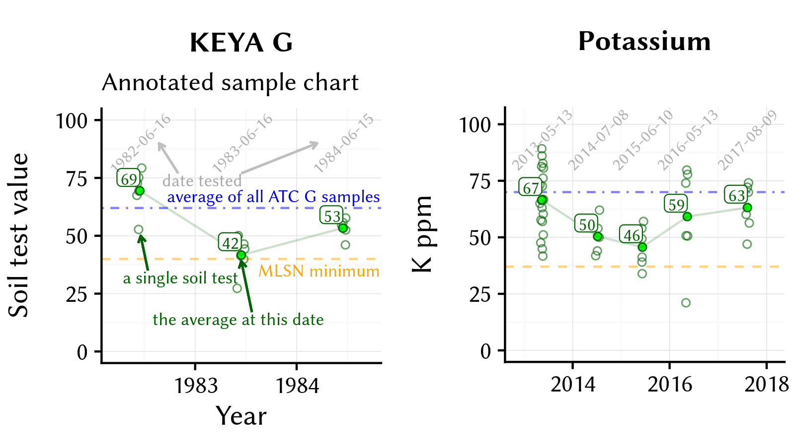

# Example charts

I created a new output format for the ATC soil tests that we provide for our clients through Brookside Labs. I like the report charts to show meaningful data, and I designed them to show five things:

1. The individual test results, by date, to show the range and variation for each turf area.
    
2. The average test result, by date and area, from which I make the fertilizer recommendation based on the MLSN guidelines.
    
3. The MLSN minimum for that element (if there is one), to see the level one doesn't want to drop below.
    
4. The average value for that element for that turf area in all the samples analyzed to date by ATC, so that one can see if that turf area is below or above an average area.
    
5. A line tracking the historical test results for that area by date. From this, one can quickly see if the element is increasing in the soil, staying the same, or decreasing, and adjustments to fertilizer applications can be made to adjust this.

{ width=100% }
