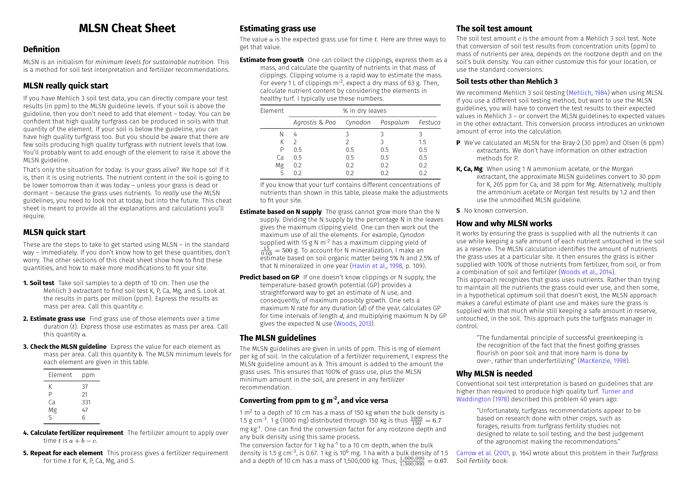
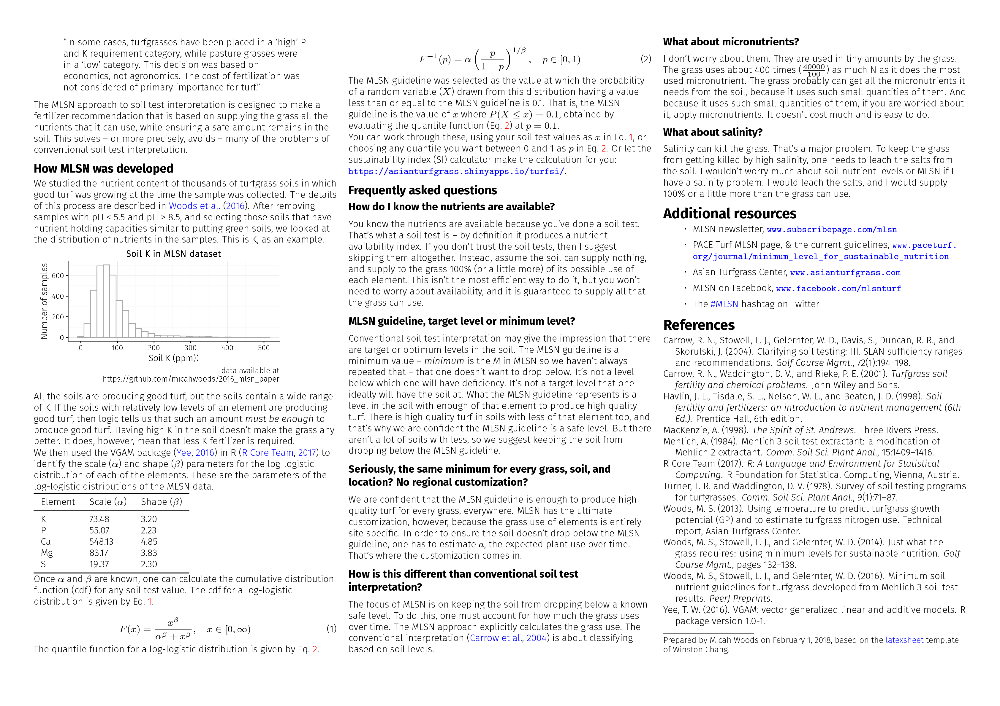
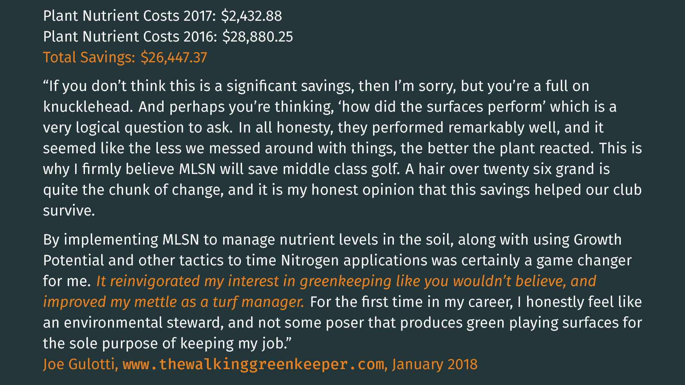

# Cheat sheet

## The MLSN cheat sheets 

These cheat sheets are meant to explain MLSN in simple terms, and also to give the full detail of how to make the calculations. I get a lot of questions about MLSN, and I thought this cheat sheet might be useful in providing some of those details and answers.

* [Cheat sheet PDF file](http://files.asianturfgrass.com/mlsn_cheat_sheet.pdf)

* [U.S. units cheat sheet PDF file](http://files.asianturfgrass.com/mlsn_cheat_sheet_us.pdf)

I made a normal one, with the units that I normally use. And I made one with United States customary units, which is identical except it uses lbs per 1000 ft^2^ to represent fertilizer amount and nutrient use.

{ width=100% }

{ width=100% }

## MLSN quotes

Jason Haines wrote about the evolution of precision fertiliser application. "As I get older and learn more about what I'm actually trying to do as a turfgrass manager I have found that most of our issues as turf managers come from generalizations," he wrote, and then went on to explain how use of MLSN -- and other techniques -- has helped to reduce those generalizations, and thus also reduced problems.

Justin Wheeler showed his fertilizer and chemical tracking on a rainy day. He explained how this has been used at Kadena in Okinawa: "Although we always fertilized based on soil tests, the MLSN allowed me to finitely calculate what the greens/tees/fairways really needed and what was a luxury or unnecessary nutrient. It stands out very clear to me where I can reallocate several thousand dollars from greens fertility next year. Even halfway through the year, these changes allowed us to actually fertilize properly the fairways, the tees, and even some of the roughs and surrounds!"

There was a discussion about MLSN on Gary Griggs' Facebook group. There were quite a few comments. Bjarni Hannesson summed it up with this: "I've been using it for the past 4 years now. No issues, good performing greens and saves a lot of money."

Joe Gulotti had two great posts about MLSN. In the first one, he tells a story, and it's all wrapped around MLSN. "I really don't know what's more creative and current than MLSN," he wrote, "Stumbling upon the MLSN guidelines was not a coincidence. It was totally meant to happen, and I can honestly say, by implementing this approach to managing soils, it probably helped our club survive at least another year, but more importantly, kept me in a job!"

In Joe's second post about MLSN, he went through the calculations of fertilizer used and cost of fertilizer, from 2016 (pre-MLSN) to 2017 (using MLSN). It's a detailed one, and he advises "if you don't feel like plowing through the breakdown, feel free to scroll past this nonsense to the good part....the cost savings!" Those savings, by the way, were $26,447.37.

{ width=100% }

## Teaching MLSN

This inquiry came to my inbox:

> "I've been asked to give a seminar on MLSN guidelines for the [ ]. I intend to keep the explanation fairly simple. Are there any frequently asked questions that you have encountered that I could use in my presentations to help me make sure I'm explaining it clear enough ... On a side note...I have been teaching this method of soil fertility interpretations for two years to my [ ] turf students and I can't quite understand the resistance I get from superintendents.... any thoughts on that?"

The following was my response.

---

Have fun with this. I agree with keeping the explanation simple. 

The most frequent question is about nutrients being "present but not available" or "locked-up" or "the soil test shows it is available but how do I know the plant can actually get it" or some such thing. This question comes up again and again.

I have tried to answer that in a ton of ways. If I would answer it today, I would say something like one can either trust the soil test, or not. If one doesn't want to trust the soil test, then I suggest making things easy, skip soil testing, and supply to the grass 100% of what it can use.

The N supply to the grass sets an upper limit on how much the grass can grow. One can't apply half a pound of N and get the same amount of growth one would get with 3 pounds of N. Very few people in the industry, superintendents or turf scientists, make the calculation of expected plant use. It is a straightforward calculation or estimate. One can measure how much the grass grows. That's time consuming. Or one can look at N supply, which sets an upper limit on growth. If one wants to add in the estimated N supply from mineralization, do so. Otherwise, just look only at N supplied as fertilizer. For every 1 pound of N, the grass has a maximum K use of 0.5 lbs, maximum P use of 0.125 pounds, maximum Ca use of .125 pounds, maximum Mg use of 0.05 lbs, maximum Fe use of 0.0025 lbs, etc.

One can skip soil testing entirely and assume the soil will supply 0 nutrients to the grass and then supply as fertilizer these amounts. Because people don't make the calculation, I don't think it is common knowledge that supply of 100% of what the grass can use -- and these are generous estimates, i.e. this is more than the grass can use, it is like a maximum possible estimate -- is very likely less than what people are currently applying. The GCSAA surveys of nutrient use show that on average more K and more P are applied than the grass can use.

The result of that 100% of what the grass can use calculation would already lead to a reduction in fertilizer use.

But my focus is not on reducing fertilizer use. It is on preventing nutrient deficiencies and ensuring the grass is supplied with all it can use. The MLSN approach does that by calculating how much the grass can use, checking to see if the soil has enough to supply that, and the fertilizer recommendation that comes from MLSN calculations is the difference between what the grass can use and what the soil can supply, keeping the MLSN amount as an untouched buffer amount in the soil.

I suppose the students who haven't worked in turf would understand the MLSN approach. As for resistance from superintendents, I don't know. I've thought about it and have a few ideas.

One, I think some people are inclined to want to do more and to make it more complicated. To others, it seems natural that doing just what is required and no more would be the optimum way.

Another, I think basically no one works through the calculations. So it is not a disagreement based on numbers, but it is based on people's feelings about this, and if they feel that they don't like it, then no amount of numbers will make them think otherwise.

Another, if I have been applying X amount of all these elements for a few years and getting good results, and then someone comes and says that wasn't necessary, and I could get the same or better results without doing that, it is like questioning what I did. But I got good results, and I am happy to keep doing the same thing. Who is this *asianturfgrass* guy from who knows where to tell me that I don't need what I need. I proved that I need these by getting good results year after year by applying them.

Another, if I have fought in my budget meeting to get $20,000 for fancy fertilizer, and I've gotten good results, how can I go to the club and say "I just found a way to save $18,000" a year on fertilizer. That might come across as "I was wasting a lot of money year after year."

Another, on the supply side, there would be very few companies supporting the MLSN approach in reality, because if they do work through the calculations even to supply 100% of what the grass could possibly use it would reduce the amount of product required. MLSN accounts for what is actually in the soil, so it would reduce product even further.

Good luck with this and thanks for teaching this.

