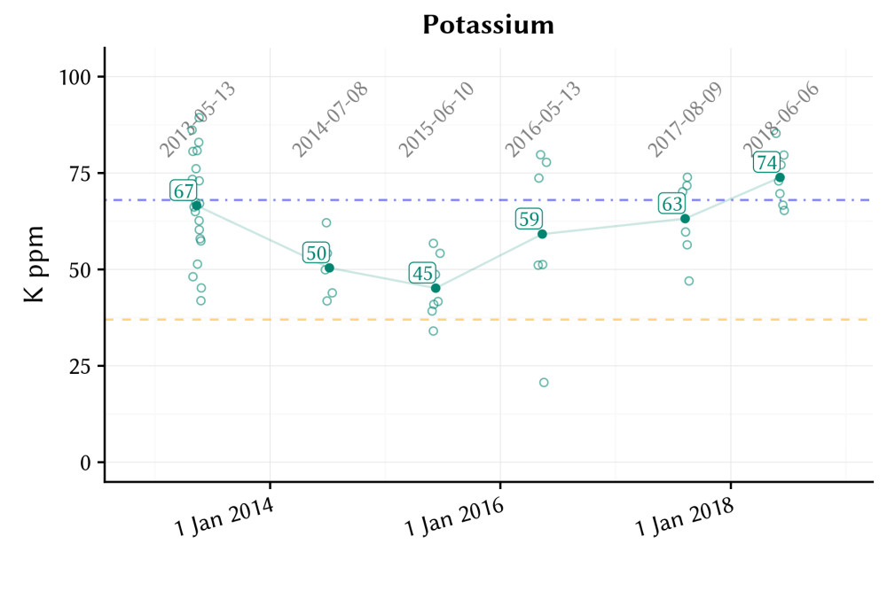

# Trend over time

In a call with Larry Stowell of PACE Turf, we reminisced about the conversations we had and the research we did, starting before 2010, that eventually led to our introduction of the MLSN guidelines in 2012. At that time we had no idea that these guidelines would come to be so widely used around the world. We had some hope that they would, but we also entertained the thought that the guidelines might be introduced and that no one would use them. 

I've spent a tremendous amount of time writing code to produce a more informative soil test report for ATC's clients, and as of last month the new report format is being produced in both English and Japanese. As an example, here are potassium (K) results from a golf course client's putting greens. The horizontal orange line marks the MLSN minimum for K, the horizontal blue line marks the median value for soil test K for all putting greens (excluding this location) in ATC's database, and the soil test results at this property since 2013 are overlaid on that.

{ width=100% }

By looking at the trend over time, one can quickly see if the amount of fertilizer applied has been causing an increase or a decrease in nutrient levels in the soil. I've been rolling out this new visualization out in reports for 25 facilities in 5 countries in the first half of 2018. I'm excited about the graphics, new calculations, and updated recommendations on these reports, and how they can be used by turf managers to optimize the nutrient inputs for their turf. Whether you do soil testing with ATC, or with another company or lab, I would encourage you to look at your data as these trends over time and at their relation to the MLSN minimums.

## Science alert

MLSN is remarkably simple. But there is a lot of logic, data, and details behind it, if you are so inclined. Remember that if you have any questions about the intricacies of MLSN, [this 2 page cheat sheet](files.asianturfgrass.com/mlsn_cheat_sheet.pdf) almost certainly has the answer.

Science alert for those who want all the details. We put the data and code behind the MLSN project into the public domain in 2016, and yet I still talk with people on a regular basis who aren't aware that this is available. If you want to check this, use the data for your own research, or improve upon MLSN, the paper, code, and data for the MLSN project are [right here](https://github.com/micahwoods/2016_mlsn_paper).