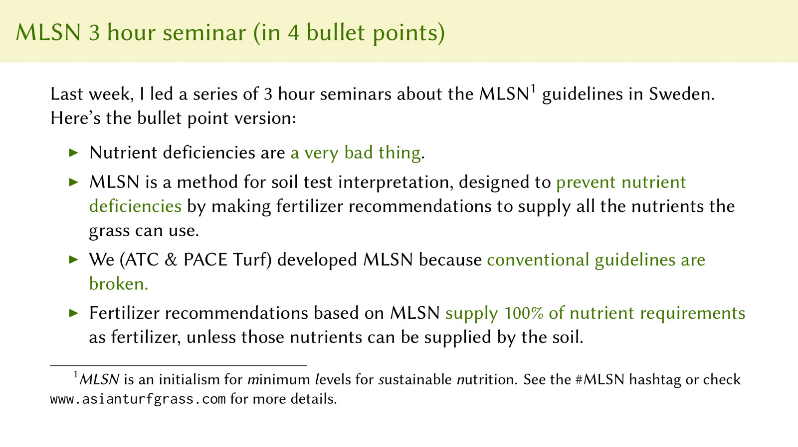

# A worldwide phenomenon

I gave a seminar in the Philippines about something I call a continuous improvement system for turfgrass. Part of that continuous improvement involves soil nutrient analyses and use of the MLSN guidelines. [This 21 minute video](https://youtu.be/3fAk32YYZ3Q) goes through that topic with slides and a soundtrack.

I gave a series of seminars about MLSN in Sweden too. Each seminar was 3 hours in duration. To summarize the seminar content, I made this one slide version.

{ width=100% }

In 2018 I made a two page summary document packed with details—I call this the MLSN Cheat Sheet. Fredrik Seeger graciously translated the document into a Swedish language version, available [here as a 2 page PDF file](http://www.files.asianturfgrass.com/mlsn_cheat_sheet_se.pdf).

When Dr. John Kaminski and Joe Gulotti recorded season 2 episode 3 of the Talking Greenkeeper podcast, Kaminski explained that MLSN wasn't discussed in the new *Turfgrass Management* book—a book which I recommend, by the way. This is a bit of an academic debate, and it is about keeping the broken status quo vs. using MLSN. If you are really interested in this debate, these posts provide what I think is a strong argument for the use of MLSN:

* [Fixing these issues in one fell swoop](https://www.asianturfgrass.com/post/fixing-these-issues-in-one-fell-swoop/)
    
* [Two solutions for the problems of turfgrass fertilizer recommendations](https://www.asianturfgrass.com/post/turfgrass-fertiliser-recommendations/)
   
Dr. Jack Fry wrote an article about MLSN in *GCM Magazine*. He wrote:

> The MLSN model fits well into the low-input strategy that many golf course superintendents have developed to help maintenance costs fit the operating budget. For some, this approach means reducing nitrogen and water applications. Maintaining turf quality, but reducing growth, can result in other savings, including labor for mowing, and equipment operation and maintenance.

> The work of Stowell, Gelernter and Woods has resulted in a turf quality-targeted procedure, rather than an agronomic crop yield-maximization procedure, for determining nutrient requirements.