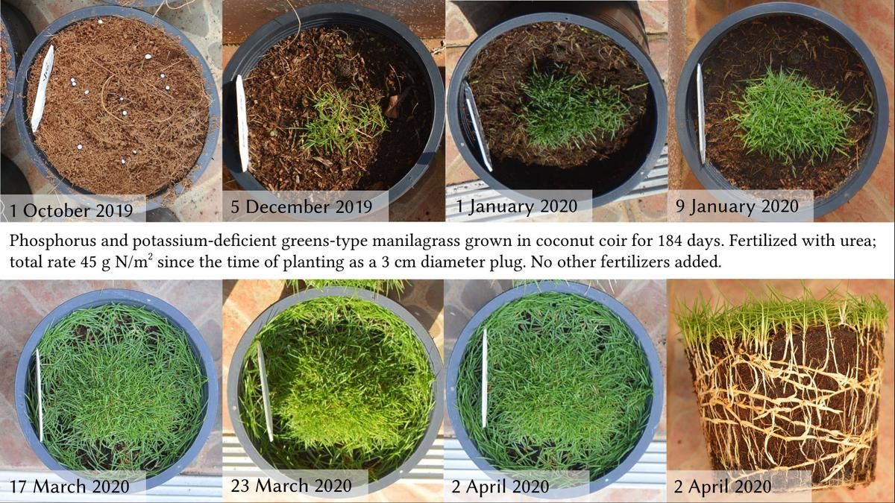
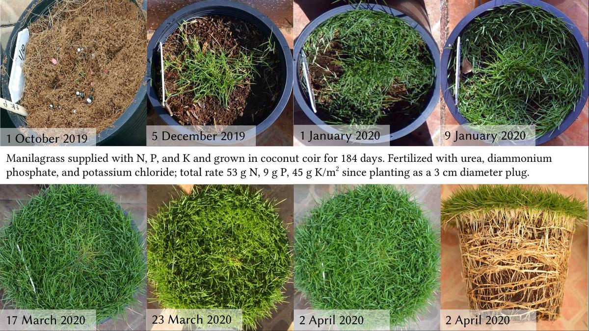

# Fertilizer cost

## Phosphorus in the spring

The SUSPHOS project is continuing this year, and you can read the latest report starting on page 18 of the STERF Yearbook. I've been involved with this project since the beginning and have enjoyed learning about the results. There will be a number of presentations and articles coming out about this project. A number of things are clear from the results so far.

1. When establishing creeping bentgrass from seed in spring, in sand with P lower than the MLSN guideline, the establishment is more rapid when P is supplied. Supplying P at 12% of the N rate⁠—that's the amount proportional to grass use⁠—was sufficient to get maximum yield. Phosphorus at 6% of N rate gave the same visual quality but not quite as much yield. This was true even in the cold temperatures (7, 12, and 17 °C) of spring.

2. When trying to improve spring green-up and turf quality in the spring, established bentgrass with soil P slightly above the MLSN guideline did not have a response in green-up or in turf quality to added P, also in the temperature range of 7 to 17 °C. Adding P, up to a rate 13.5% that of N, did increase the clipping yield.

These results suggest that the current MLSN guidelines for P are reasonable levels in relation to turf performance. And the results also suggest that adding P during cool spring temperatures, either for new turf establishment or for encouraging green-up of established turf, won't improve turf quality if the soil already has sufficient P. Clipping yield appears to reach a maximum when P fertilizer is applied at rates proportional to the N supply and the standard leaf N:P ratio.

## Cost of fertilizer

I grew some grass at home, in pots, applying nutrients to try to get differences for demonstrative photos.

{ width=100% }
You might think this grass looks really healthy. It does, actually. But I only fertilized it with urea for 6 months. A lot of urea, no P, and no K.

But compare the urea only grass to the one supplied with P and K too, and there's a big difference.

{ width=100% }
I don't often discuss cost or product choice. What I do focus on is quantity. How much of each nutrient is required, that sort of thing. It's interesting, in the case of the grass grown in pots and fertilized with high rates of nutrients, to extrapolate those rates out over a larger area.

For example, the N-only pot was supplied with 45 g N/m2. To consider this in golf course terms, 1.5 ha (3.7 acres) would be a slightly larger than average set of putting greens for 18 holes. For 1.5 ha, to supply that massive amount of N from urea cost 17,550 THB. That's about USD $535.

This was a grow-in, so I put a lot of N to stimulate growth. I also wanted to demonstrate differences between N only and N+P+K, so I made sure to create a high P and K demand by supplying a high N rate. Realistically, in a tropical climate, this is about twice as much N as a green of this species might need in a year. So figure the cost could be half that, about $267 for a set of greens, per year. And in a part of the world with winter, where grass wouldn't grow much in winter, the annual N rate for this grass would be about a fourth of what I used. So the annual N cost for 18 holes using urea would be about $134.

Of course that N-only pot was deficient in P and K. What if we supply that same amount of N from urea, plus add more K than the grass can use from KCl, plus all the P (and some more N) the grass can use from DAP? Now the total cost, extrapolated to 1.5 ha, is 47,196 THB, or USD $1,440. In a tropical climate this grass would reasonably use half this amount in a year, so cost would be about $720. In a place with winter, the cost for N + P + K would be about $360.

One way to save money with fertilizer is to use a method such as MLSN. This ensures that the only nutrients that are applied are those that are really required. Another way to save money is to supply those necessary nutrients using products such as urea and potassium chloride. That's where the big savings happen, actually.

## Four ways to find nutrient requirements

Let's say we would like a systematic way to find nutrient requirements. And we'd like to do better than guessing. Here are four options.

### Arthur's *Practical Greenkeeping*

I don't have the book in front of me, so from memory I'll recall this as basically a little N, almost never P or K, no lime. And this works great until it doesn't. Where it works great is places with a climate like the UK and northern Europe. And within that climate, his approach works with turf that is grown on soil, or with turf grown on sandy soils with relatively high nutrient content. Where it doesn't work is places outside of that climate zone, or places within that climate zone growing in a particular type of sand rootzone. Of course Arthur wrote that such sands should not be used. But some places have used them. I like Arthur's approach, but let's recognize that it doesn't work in Hong Kong, nor would it work on a USGA green with a silica sand in London. 

### STERF's Precision Fertilisation

This is superb. Demand-driven fertilisation of Ericsson, also called precision fertilisation, supplies 100% of the nutrients the grass uses, throughout the year. It is based on how much the grass is growing. The problem with this is some possible inefficiency. If you happen to be growing in a soil with plenty of K and plenty of Ca, for example, why would you add more? And if you want to minimise *Poa annua* invasion, then it wouldn't make any sense to apply P when the soil contains plenty. 

### MLSN

Arthur's approach, and the precision fertilisation approach, both ignore the soil. The MLSN approach says let's see what is in the soil, let's see how much the grass is going to use going forward, and from that we will get a site-specific fertiliser recommendation. It works for any grass, anywhere. In fact, MLSN recommendations simplify to the precision fertilisation recommendation when the soil has nutrient levels right at the MLSN guideline. But when the soil has more than that? The MLSN approach accounts for those nutrients in the soil, and the fertiliser recommendation goes down accordingly.

### Something else

Is there another approach? Maybe guessing? Or experience? Both guessing and experience can work great. But they don't transfer very well to another site, to another grass type, or to another part of the world. I like precision fertilisation and MLSN because they should work everywhere.

Here's a simple exercise. Look at your annual fertiliser supply. And calculate what it would be under precision fertilisation. The maximum amount of fertiliser one should apply is 100% of grass use, right? Does it make sense to apply more than that? Precision fertilisation is 100% of grass use. But most turfgrass managers are already using **more** than that.

I'll add here a couple quotes:

> How many more times do I have to say that applying nutrients to turfgrass growing on soil already well supplied with the nutrients is a waste of time and money?

Wayne Kussow in "[Manipulating Creeping Bentgrass Nutrition](http://tic.lib.msu.edu/tgif/flink?recno=55302)," 1995, in *The Grass Roots*

> Why use and pay for nutrients that the grass does not need or the soil does not require?

> Clearly, extra fertilizer nutrients only increase the cost of your fertilizer program with little benefit to the turf.

> Remember, extra nutrients in the soil will not make turf extra healthy.

Stanley Zontek et al. in "[Does the Grass Know the Cost?](http://gsrpdf.lib.msu.edu/ticpdf.py?file=/2010s/2010/100532.pdf), 2010. in the USGA *Green Section Record*
