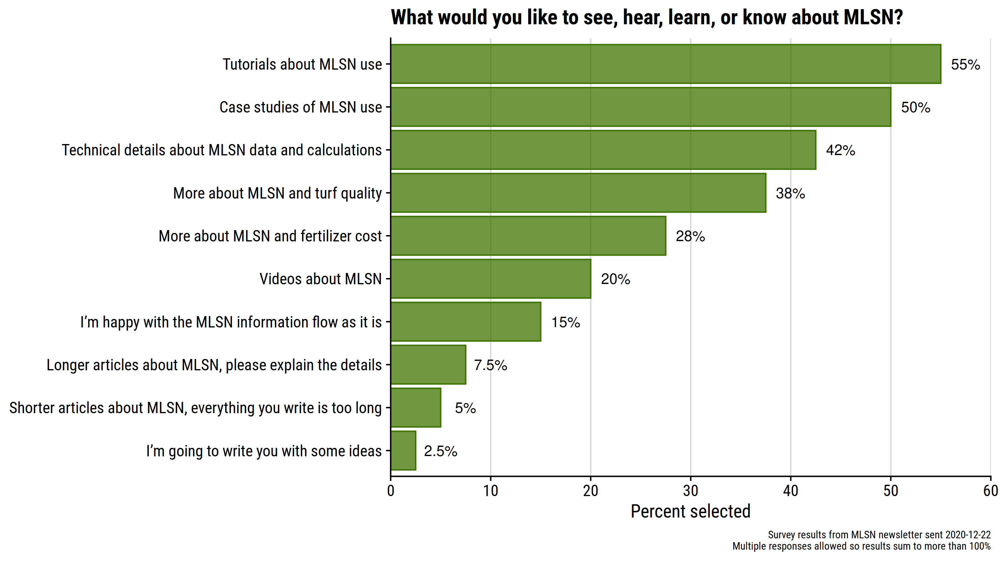

# Tutorials, case studies, & community knowledge

## Survey results 

At the end of 2020, I asked what type of information you’d most like to see. These were the results.

{ width=100% }

### Tutorials and case studies

The survey's top two requests were for tutorials and case studies. Here
are a few:

* [MLSN MATH Step by
Step](https://www.turfhacker.com/2018/03/mlsn-math-step-by-step.html) on
Jason Haines' TurfHacker site.

* Brad Revill's [MLSN
series](https://brtagronomy.com/goingagainstthegrain/category/MLSN) on
his BRT Agronomy page.

* PACE Turf's [Climate Appraisal
Forms](https://www.paceturf.org/index.php/journal/climate) also work
through the MLSN calculations of a site-specific fertilizer requirement.

* Joe Gulotti's tutorial about how [he implemented
MLSN](http://www.thewalkinggreenkeeper.com/2018/01/near-end-of-summer-last-season-john.html),
going all the way from soil test results to fertilizer prices, and most
importantly, results.

### Community knowledge

When I write about MLSN on the ATC website (see [all pages tagged MLSN here](https://www.asianturfgrass.com/tag/mlsn/)), or when I send out this newsletter, it's a one way flow of information, and it is always in my voice, with my communication style.

There are people all over the world who have used MLSN, or thought about it, and have plenty of information to share as well. When I saw the survey results with a clear preference for more case studies and tutorials, I thought in this newsletter I might ask for volunteers to create them. I also receive questions, sometimes, that I think other people are better equipped to answer. For example, this inquiry came by email:

> I'm trying to build our fertilizer program with going along with the
> MLSN guidelines ... Do you have any recommendations, articles or
> webinars available where you talk about affordable fertilizers
> products? For my N source I'm going to use urea and for K I am
> thinking about using 0-0-50. Any tips or pointers would be greatly
> appreciated.

I'd like to answer that in detail, but I'm in a different country from my correspondent and don't even know where to buy those products at their location. And I'm sure someone like Andrew McDaniel or Chris Tritabaugh or Grant Saunders, who I presume have used those products recently and might have better advice about rates and nozzles and such, would be able to give better information.

As I was thinking about all that, and planning my appeal for volunteers to create these tutorials---in fact, I mentioned to Brad Revill that he might be able to write some---it occurred to me that a Discord server about MLSN would have the potential to provide all this information, and then some. People could ask questions, and the worldwide community of people who have experience and knowledge about this could join in (if they like) to share information and answer questions. In this way, the questions could be answered better, it would be interactive, and response times could be faster. It could be an amplification and improvement on all the information I try to share.

It didn't take long before I realized that the same thing applies to [\#ClipVol](https://www.asianturfgrass.com/project/clipvol/) and [\#OM246](https://www.asianturfgrass.com/project/om246/) and the other things I've been working on. An atc-turf server with an MLSN topic channel on it made a lot more sense than a standalone MLSN-only server.

So I set up the [atc-turf Discord server](https://discord.gg/K8tWApB5ME), and I hope you'll check
it out. If that is a place where you'd like to ask some questions or share some information, I'll see you there. Who knows, I may even have some "office hours" there occasionally. But what I really think this can be---what is has the potential to be---is a platform that's a fun place for people who are using some of these techniques, or are interested in learning how to do so, to share what they are doing and help others to
be successful.

